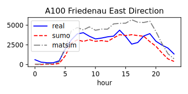
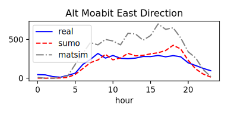
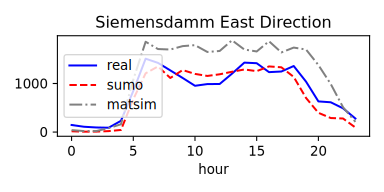

# Berlin Sumo Traffic (BeST) Scenario

https://user-images.githubusercontent.com/2386865/186914163-1225cb32-7a1f-4bdd-8550-2be9ce9a96dd.mp4

## 24 Hours of Traffic in Berlin for SUMO and Eclipse MOSAIC

This simulation scenario provides **motorized private transport** traffic for over **24 hours for the whole city of Berlin**. 
With over **2,25 million trips** within an area of 800 km², this is **the largest microscopic traffic simulation scenario** we are currently aware of.

The scenario was made for [Eclipse MOSAIC](https://github.com/eclipse/mosaic) and thus requires it to run. 
It is, however, also possible to run it with [Eclipse SUMO](https://github.com/eclipse/sumo) only.
If you plan to test your own mobility solutions encoperating V2X technology or message exchange via LTE/5G, then Eclipse MOSAIC is your way to go. 
Here you can combine the traffic with communcation and application simulation, thus creating a holistic system solution on a large-scale.

The scenario is based on the [MATSim Open Berlin Scenario](https://github.com/matsim-scenarios/matsim-berlin). 
We extracted traffic demand from this scenario and re-calibrated all routes to achieve a user equilibrium.
More details on our creation process can be found in the provided reference and in the background section and the bottom of this file.

## Characteristics

Some basic characteristics describing the scenario:

|Characterstic|Number|
|-----------------|--------|
| Number of nodes | 27 404 |
| Number of edges	| 69 234 |
| Number of junctions controlled by traffic signals | 2 249 |
| Number of trips | 2 248 952 |
| Average duration of each trip | 805 sec |
| Average distance of each trip | 7,9 km |
| Overall mean speed compared to speed limits | 0.71 |
| Total number of teleports | 2 786 |
| Simulation duration on 3,4 GHz CPU (no GUI) | 7 hours |

We furthermore compared the simulated counts on some certain streets against real data from [Digitale Plattform Berlin](https://api.viz.berlin.de/daten/verkehrsdetektion):






## License and Attribution

All files belonging to this scenario definition are licensed under <a rel="license" href="http://creativecommons.org/licenses/by/4.0/">Creative Commons Attribution 4.0 International License</a>
<a rel="license" href="http://creativecommons.org/licenses/by/4.0/"> </a>.

The usage of this scenario has to be attributed by either providing a link to this repository, or by citing this reference:

> K. Schrab, R. Protzmann, and I. Radusch, "*A Large-Scale Traffic Scenario of Berlin for Evaluating Smart Mobility Applications*" in Proceedings of 6th Conference on Sustainable Urban Mobility, 2022.

## Installation and Usage

1. Install Eclipse MOSAIC, e.g. by following [this manual](https://www.eclipse.org/mosaic/docs/getting_started)
2. Install Eclipse SUMO, e.g. from https://sumo.dlr.de/docs/Downloads.php
3. Clone this repository to an arbitrary folder.
   ```sh
   git clone git@github.com:mosaic-addons/best-scenario.git
   ```
4. Execute the `download_best_scenario.py`[^1] script in `/path/to/repository/scenario/sumo` using [Python](https://www.python.org/downloads).
   ```sh
   cd /path/to/repository/scenario/sumo
   py download_best_scenario.py
   ```
5. Go to the installation directory of **Eclipse MOSAIC** and type:
   ```sh
   ./mosaic.bat -c /path/to/repository/scenario/scenario_config.json -w 120
   ```
6. Be aware that completing this scenario requires several hours to complete. You can, however, reduce the simulation duration in the `scenario_config.json`.

[^1]: This download script will generate a tracking record for each download of the best-scenario from www.dcaiti.tu-berlin.de. To disable tracking, you can set the field `do_not_track` in the `download_best_scenario.py` to `true`.

In order to see a visualization of the traffic, simply edit the file `etc/runtime.json` in the Eclipse MOSAIC main directory.
Replace `SumoAmbassador` with `SumoGuiAmbassador` and save the file. 
Then execute the scenario.
Please note that using the visualization in `sumo-gui` slows down the simulation significantly due to its immense size.

```
...
  {
    "id": "sumo",
    "classname": "org.eclipse.mosaic.fed.sumo.ambassador.SumoGuiAmbassador",
    "configuration": "sumo_config.json",
    ...
  }
...
```

---
The scenario can also be used with SUMO only. Once you installed the scenario, you can execute it with SUMO directly:

```sh
cd sumo
sumo -c /path/to/repository/scenario/sumo/best-scenario.sumocfg
```

## Background

Find out more about the creation process of the scenario by reading our publication once it has been published in the Conference Proceeedings of [CSUM 2022](https://csum.civ.uth.gr).
